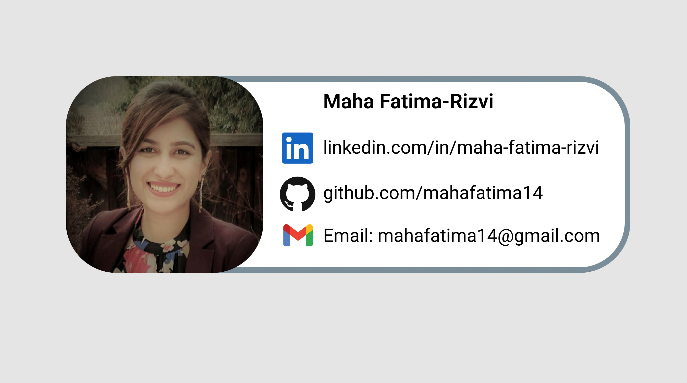

# MyLogics - Inventory tracking web app

Shopify Backend Intern Technical Challenge - Fall 2022

An inventory tracking web application for a logistics company. Allows the user to perform the basic CRUD functionalities (Create inventory, Read(View inventory), Update Inventory and Delete inventory).

It also lets the user create an additional warehouse and add inventory to that specific warehouse


## Navigation

- [How It Works](#how-it-works)
- [Tech Stack](#tech-stack)
- [Setup and Installation](#setup)
- [Justification](#justification)
- [About the Developer](#about-developer)

## <a name="how-it-works"></a>How It Works


 
<details><summary>Add an inventory | Add a Warehouse  , method = [POST] </summary>
<p>

#### Users are able to add inventory, and the information is stored as Item name, manufacturer, Quantity added, Comments ("Fragile, Produce..") and created_at/updated_at. A relationship is formed between inventory and warehouse, by using the warehouse_id as the FK in the inventory table. Warehouse information is stored as location and created_at/updated_at.

</p>
</details>

<details><summary>Edit the inventory, method = [PUT] </summary>
<p>

#### Users can update an inventory in the database through a POST request to the update form, which also gives the user to update the warehouse, or create and assign inventory to a new warehouse. The new warehouse is added in the database, and the updated_at field is changed to reflect the time the update is made on the inventory. 

</p>
</details>

<details><summary>Delete Inventory , methods = [POST]</summary>
<p>

#### Users are able to delete an inventory from the database. 

</p>
</details>

<details><summary>View all inventory | View every warehouse , methods = [GET] </summary>
<p>

#### Users are able to view all the inventory upon the landing page, sorted into a Bootstrap table. 

</p>
</details>

## <a name="tech-stack"></a>Tech Stack

<strong>Back-End:</strong> Python, Flask, Jinja, SQLAlchemyL<br>
<strong>Front-End:</strong> HTML/ CSS, Bootstrap <br>
<strong>Database:</strong> PostgreSQL <br>


## <a name="setup"></a>Set Up/ Installation

### Prerequisites

Please be sure to have Python 3.6 and PostgreSQL downloaded before you clone this repository.

### Installing

On local machine, go to a directory where you want to work and clone Over The Mood repository:

```
$ git clone https://github.com/mahafatima14/Shopify_developer_tech_challenge.git
```

Create a virtual environment:

```
$ virtualenv env
```

Install dependencies:

```
$ pip3 install -r requirements.txt
```

Create database:

```
$ createdb inventory
```

Build database tables and fill database with seed file:

```
$ python3 model.py
$ python3 seed.py
```

### Running Locally via the Command Line

Be sure your virtual environment is activated:

```
source virtual env/bin/activate

```

Run MyLogics:

```
$ python3 server.py
```

Open your browser and navigate to:

```
http://localhost:5000/
```

### Future Features

- Write python unittest to ensure API points are returning what they are supposed to. 
- Track import/export on the inventory item
- Add exact address and other information (such as weather, total inventory count) to warehouse3


## <a name="justification"></a>Justification

I chose to work in Python along with its web framework Flask. I chose Flask because it is a light flexible framework, which is ideal for creating customizable API endpoints.


## <a name="about-developer"></a>About the Developer

MyLogics is created by Maha Fatima, a full stack Software engineer in the Bay Area, San Francisco. She comes from a non-traditional background, she completed her Hon. BSc in Biomedical sciences from the University of Waterloo and throughout her degree and after, she worked at the pharmacy and labs as a chemist. She is a career-driven individual who went on to get her PMP and scrum master certifications. 
Upon her move to California, she got exposed to the tech world and enrolled in Hackbright's Intro to Python 101 course and fell in love with the problem solving, utilizing software, and automation to create solutions. She went on to complete Hackbright's prep course and enrolled in Hackbrights Software engineering fellowship program - April 2022.



<p><a href="https://www.linkedin.com/in/maha-fatima-rizvi/">
  
</a>
</p>
